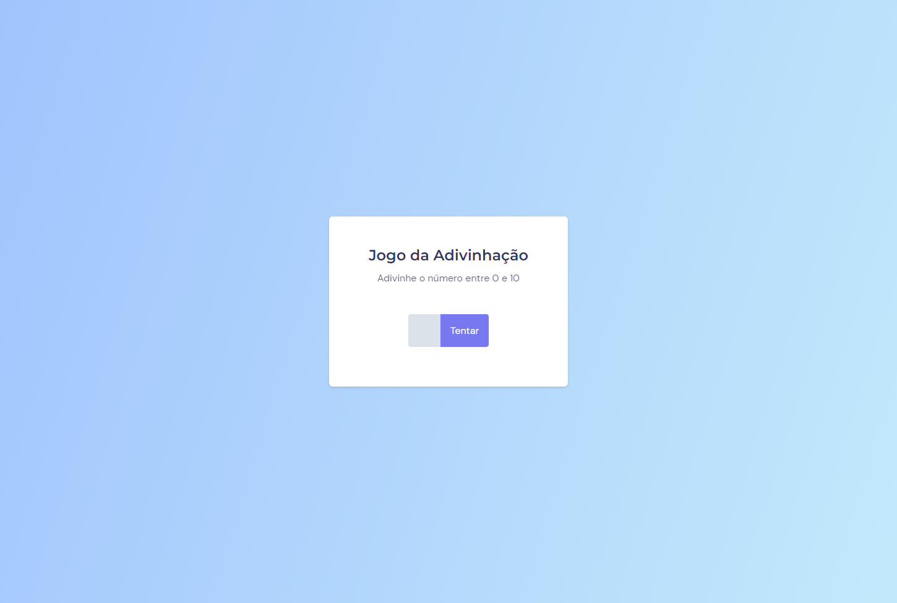

# Jogo da Adivinhação

## 💻 Projeto
Esse é um projeto web de um jogo onde o usuário deve acertar qual número de 0 a 10 o sistema está gerando

## 🚀 Tecnologias
Esse projeto foi desenvolvido durante no módulo 5 da Rocketseat com as seguintes tecnologias:

HTML
CSS
Javascript
Git e Github

## 🏷️ Layout
Você pode visualizar o layout do projeto através [figma](https://www.figma.com/file/rsRksDcHW42cVzVqwKmEjf/Jogo-Adivinha%C3%A7%C3%A3o-(Copy)?type=design&node-id=0%3A1&t=9kQY9hVFmJ16znvu-1). É necessário ter uma conta no [Figma](https://www.figma.com)